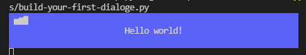

# PyBUD: Python Beauty
**A python library for creating beautiful GUIs in console, with tons of different components, such as `Dialog`s, `Widget`s, `Drawable`s, `Drawer`, and more!**

## Installation
you can use pip:
```
pip install pybud-gui -U
```
or install from github:
```
pip install git+https://github.com/Amirali1059/pybud-gui.git
```
## Documentation
### Table of Contents:
- [Getting Started](#getting-started)
  - [Build Your First `Dialog`](#build-your-first-dialog)
---
## Getting Started
Using pybud-gui you can easily build dialogs with just a few lines of code, so lets get started!
### Build Your First Dialog
first import classes:
```python
# import the main dialog class
from pybud.gui.dialog import AutoDialog
# import widgets
from pybud.gui.widgets import WidgetLabel
# import types
from pybud.deftypes import Point, Size
```
and build the dialog in just 3 lines of code!
```python
# build the main dialog, set width and background color
d = AutoDialog(width=60, background_color=(90, 90, 250))
# add the main widget, set text, width and position
d.add_widget(WidgetLabel("Hello world!", pos=Point(y=1), size=Size(w=60)))
# show the dialoge
d.show()
```
Output:

