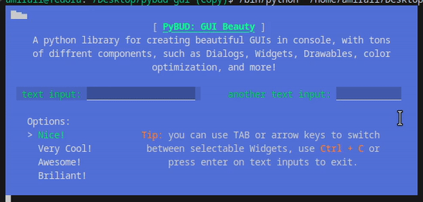
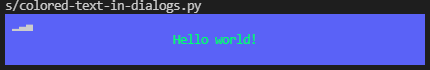

# PyBUD: Python Beauty

[](https://www.codefactor.io/repository/github/amirali1059/pybud-gui) [](https://pypi.org/project/pybud-gui/)

**A python library for creating beautiful GUIs in console, with tons of different components, such as `Dialog`s, `Widget`s, `Drawable`s, `Drawer`, and more!**



---
## Installation:

you can use pip:

```
pip install pybud-gui -U
```

or install from github:

```
pip install git+https://github.com/Amirali1059/pybud-gui.git
```

## Documentation:

#### Table of Contents:

- [Getting Started](#getting-started)

- [Build Your First Dialog](#build-your-first-dialog)

- [Colored Text In Dialogs](#colored-text-in-dialogs)

- [Gather inputs from the user](#gather-inputs-from-the-user)
---
## Getting Started

Using `pybud-gui` you can build dialogs with just a few lines of code, lets get started!

### Build Your First Dialog

first import classes:

```python
# import the main dialog class
from pybud.gui.dialog import AutoDialog
# import widgets
from pybud.gui.widgets import WidgetLabel
```

and build the dialog in just 3 lines of code!

```python
# build the main dialog, set width and background color
d = AutoDialog(width=60, background_color=(90, 90, 250))
# add the main widget, set text, width and position
d.add_widget(WidgetLabel("Hello world!", pos=[0, 1], size=[60, None]))
# show the dialog
d.show()
```

Output:

> 
### Colored Text In Dialogs

first import classes:

```python
# import the main dialog class
from pybud.gui.dialog import AutoDialog
# import widgets
from pybud.gui.widgets import WidgetLabel
# import `ColoredString` (using this class you can define text with color)
from pybud.drawer.ansi import AnsiString as AStr
```

and build the dialog just like above, but with `ColoredString`

```python
# build the main dialog, set width and background color
d = AutoDialog(width=60, background_color=(90, 90, 250))
# add a label widget, set text, width and position
d.add_widget(WidgetLabel(
	# define a ColoredString object that renders text with colors
	# you can set both forecolor and backcolor
	text=AStr("Hello world!", fore = (90, 250, 90)),
	pos=[0, 1],
	size=[60, None]
	)
)
# show the dialog
d.show()
```

Output:
>